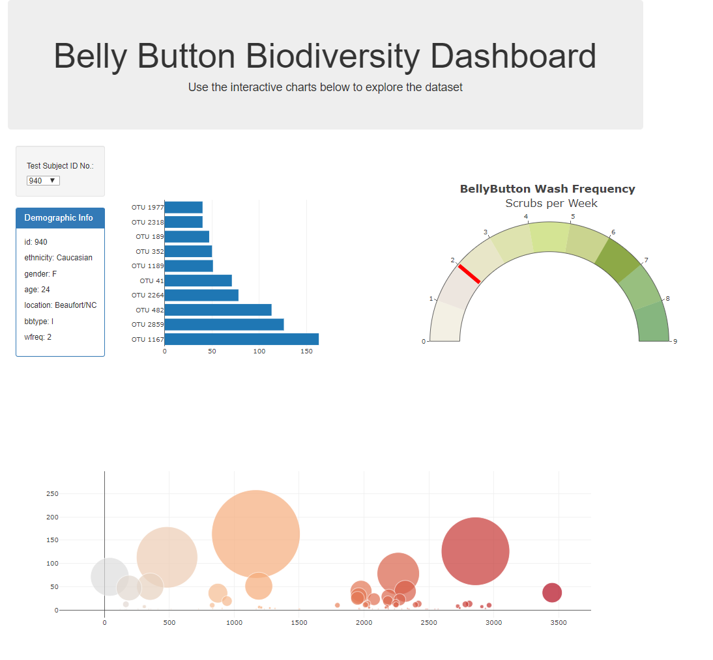

# Belly Button Biodiversity

For this project I build an interactive dashboard to explore the Belly Button Biodiversity dataset, which catalogs the microbes that colonize human navels.

The dataset reveals that a small handful of microbial species (also called operational taxonomic units, or OTUs, in the study) were present in more than 70% of people, while the rest were relatively rare.

Project Deployed :[https://jcosta16.github.io/bellybutton/](https://jcosta16.github.io/bellybutton/)

## Applied Technologies
* JSON
* HTML/CSS
* JavaScript
  - D3 
## Images

